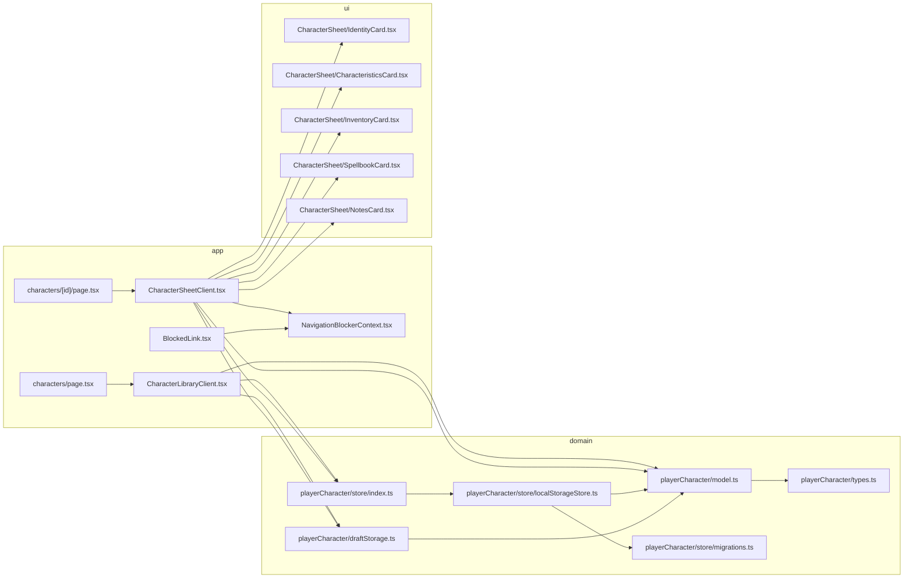

# Character manager

This document describes **what** the character manager implements (drafts, saved sheets, constraints, import/export) and **how** it is wired in code (route flow, storage, normalization, navigation blocking). It is meant for maintainers and for AI assistants editing this repo.

Game: _Les Souvenirs du Protecteur_ (LSDP). UI strings live in `src/messages/fr.ts` (`copy.playerCharacters`).

---

## 1. Scope

| Area                | In scope                                                                                                     |
| ------------------- | ------------------------------------------------------------------------------------------------------------ |
| Character lifecycle | Create draft → edit sheet → save to local library                                                            |
| Persistence         | Saved characters in **`localStorage`** (`lsdp:playerCharacters:v1`), drafts in **`sessionStorage`** per tab  |
| Data model          | Typed `PlayerCharacter` with archetype, stat pools, inventory, spellbook, notes, metadata timestamps         |
| Validation          | Domain validation before persistence (money >= 0, pool bounds, inventory/spellbook limits, non-empty labels) |
| Import/export       | JSON copy/export and file import with upsert/replace semantics in store                                      |
| Unsaved navigation  | Intercepts in-app links + back/forward + tab close when form is dirty                                        |
| UI split            | Library page (`/characters`) and detail sheet (`/characters/[id]`)                                           |

Out of scope (today): cloud sync, multi-device persistence, server-side storage, collaborative editing.

---

## 2. Conceptual model

### 2.1 Two persistence tiers

- **Saved characters**: canonical list persisted in `localStorage` under `lsdp:playerCharacters:v1`.
- **Draft character**: transient entry persisted in `sessionStorage` under `lsdp:playerCharacterDraft:v1:<id>`.

The creation flow intentionally starts in draft mode so a user can cancel without adding anything to the library.

### 2.2 Character identity and timestamps

Each character has:

- stable `id` (`randomUUID` when available, fallback timestamp/random),
- `createdAt` and `updatedAt` ISO strings,
- fixed `schemaVersion` (`PLAYER_CHARACTER_SCHEMA_VERSION = 1`).

`updatedAt` is refreshed on every save (`touchPlayerCharacter`) and is used for list ordering (latest first).

### 2.3 Archetype defaults

Archetype drives initial pool defaults:

- `warrior`: health 2, courage 4, stamina 3
- `pilgrim`: health 3, courage 2, stamina 4
- `bard`: health 4, courage 3, stamina 2

When the archetype field changes in the sheet UI, pools are reset to archetype defaults.

### 2.4 Capacity rules

- Inventory hard cap: **30**
- Inventory dynamic cap: **stamina.current \* 6**
- Effective inventory cap for validation: both constraints must pass.
- Spellbook cap: **6**
- For each pool (`health`, `courage`, `stamina`): `current <= max`
- `money >= 0`

The UI also mirrors caps (inventory add button disabled at current computed limit, spellbook add disabled at 6), but store validation is the authoritative guard.

### 2.5 Draft vs saved editing modes

`CharacterSheetClient` loads state in this order:

1. saved character by route id (`store.get`)
2. draft by id (`loadDraft`)
3. none (not found state)

This gives route URLs stable behavior while preserving unsaved newly-created draft sheets.

---

## 3. Technical architecture

### 3.1 Module map

| Path                                                 | Role                                                                            |
| ---------------------------------------------------- | ------------------------------------------------------------------------------- |
| `src/lib/playerCharacter/types.ts`                   | Core types (`PlayerCharacter`, `StatPool`, `InventoryItem`, import result/mode) |
| `src/lib/playerCharacter/model.ts`                   | Defaults, normalization, id generation, validation, inventory cap computation   |
| `src/lib/playerCharacter/draftStorage.ts`            | Draft save/load/clear in `sessionStorage`                                       |
| `src/lib/playerCharacter/store/localStorageStore.ts` | CRUD + import/export against `localStorage`                                     |
| `src/lib/playerCharacter/store/migrations.ts`        | JSON parse/stringify envelope + merge strategy for imports                      |
| `src/lib/playerCharacter/store/index.ts`             | In-memory singleton accessor `getCharacterStore()`                              |
| `src/app/characters/CharacterLibraryClient.tsx`      | Library list, create, delete, import, export, open sheet                        |
| `src/app/characters/[id]/CharacterSheetClient.tsx`   | Sheet load/edit/save, draft handling, unsaved navigation guard                  |
| `src/components/CharacterSheet/*.tsx`                | Form sub-sections: identity, characteristics, inventory, spellbook, notes       |
| `src/components/Navigation/BlockedLink.tsx`          | Link wrapper that consults navigation blocker handler                           |
| `src/app/contexts/NavigationBlockerContext.tsx`      | Shared blocker handler context                                                  |

### 3.2 Creation and first edit flow

On `/characters`:

1. `handleCreate` builds a default character with `createPlayerCharacter()`.
2. It writes that object to draft storage (`saveDraft`).
3. It navigates to `/characters/<id>`.

On `/characters/<id>` load:

1. Try persisted store entry.
2. Else try draft entry.
3. If in draft mode, UI shows identity-only form with `Annuler` and `Sauvegarder`.

`Annuler` in draft mode clears draft and returns to library.

### 3.3 Save flow

`handleFinish` in `CharacterSheetClient`:

1. Merge current form values into the loaded character object.
2. Call `store.save(payload)`.
3. Store normalizes + validates + touches timestamp.
4. If mode was draft, clear session draft.
5. Set local state to saved mode and show success toast.

Validation errors are thrown as semicolon-separated messages and surfaced both in a toast and in an error alert block.

### 3.4 Import/export behavior

- **Export**: `store.exportAll()` returns a JSON string envelope:
  - `{ schemaVersion: 1, characters: [...] }`
  - copied to clipboard from the library page.
- **Import**: file text is parsed with `parsePlayerCharacters`.
  - accepts either raw arrays or envelope objects with `characters`.
  - invalid JSON or malformed entries collapse to an empty import set.
  - each imported character is validated for persistence; invalid records are discarded.
  - library currently imports in `upsert` mode from UI (`store.importAll(raw, 'upsert')`).

`upsert`: same id updates existing record, new id creates record.  
`replace`: supported by store API, but not currently exposed in library UI.

### 3.5 Normalization guarantees

Any boundary read/write normalizes data:

- storage reads (`parsePlayerCharacters`) normalize each record,
- saves normalize incoming payload,
- drafts normalize before save/load.

Normalization behavior includes:

- non-finite numerics coerced to integer fallbacks,
- `money` clamped to >= 0,
- pool values clamped to non-negative and `current <= max`,
- inventory/spellbook item ids auto-generated if missing,
- inventory and spellbook arrays truncated to 30/6,
- unsupported archetype/gender values replaced with defaults.

This makes persisted data robust against manual edits or old malformed payloads.

---

## 4. Unsaved navigation interception

The sheet blocks accidental navigation when form fields are dirty:

- **In-app links using `BlockedLink`**: `onNavigate` is prevented, then shared handler decides whether to continue.
- **Browser close/refresh**: `beforeunload` prompt when touched and interception is armed.
- **Back/forward (`popstate`)**: if user cancels leave, URL is restored to a stable snapshot.

Important details in `CharacterSheetClient`:

- Interception is delayed until after initial form settle (`setTimeout(..., 0)`) to avoid prompts during hydration/setup.
- `leaveConfirmingRef` prevents stacked modals.
- `setHandler` is registered/unregistered in `NavigationBlockerContext` so other pages remain unaffected.

---

## 5. UI composition

Saved mode sheet sections:

- `IdentityCard`: name, archetype, optional gender.
- `CharacteristicsCard`: honor, inspiration, money, and three current/max pools.
- `InventoryCard`: dynamic limit text + add/remove lines (name, quantity, note).
- `SpellbookCard`: max 6 entries (name, note).
- `NotesCard`: free text area.

Draft mode currently renders only `IdentityCard` plus cancel/save actions.

---

## 6. Storage formats

### 6.1 Library (`localStorage`)

- key: `lsdp:playerCharacters:v1`
- value: JSON string from `stringifyPlayerCharacters`:
  - `schemaVersion: 1`
  - `characters: PlayerCharacter[]`

### 6.2 Draft (`sessionStorage`)

- key prefix: `lsdp:playerCharacterDraft:v1:`
- full key: `<prefix><characterId>`
- value: serialized single `PlayerCharacter` JSON blob

---

## 7. Extension notes

1. **Adding fields to `PlayerCharacter`**
   - update `types.ts`,
   - update defaults + normalization in `model.ts`,
   - update `SheetFormValues`, `toFormValues`, and save merge path in `CharacterSheetClient`,
   - update relevant section components and copy strings.
2. **Schema/version changes**
   - bump storage keys or add migration support in `migrations.ts`,
   - preserve backward decode when possible.
3. **Changing validation rules**
   - enforce in `validatePlayerCharacterForPersistence`,
   - reflect limits in UI components to avoid confusing save-time failures.
4. **Exposing replace import in UI**
   - library currently hardcodes `'upsert'`; add user choice before calling `store.importAll`.
5. **Tests**
   - existing scripts are `test` (Vitest), `test:coverage`, and `test:e2e` (Playwright).
   - prioritize:
     - normalization idempotence,
     - save validation errors,
     - import merge counts,
     - unsaved navigation guard behavior (unit/integration).

---

## 8. Quick reference

| Question                                       | Where to look                                      |
| ---------------------------------------------- | -------------------------------------------------- |
| How are default character values chosen?       | `createDefaultPlayerCharacterInput` in `model.ts`  |
| Why does archetype change reset pools?         | Archetype watcher effect in `CharacterSheetClient` |
| Why can inventory save fail?                   | `validatePlayerCharacterForPersistence`            |
| Where is local persistence implemented?        | `store/localStorageStore.ts`                       |
| What JSON shape does import/export use?        | `store/migrations.ts`                              |
| Why are unsaved-change prompts shown on links? | `BlockedLink` + `NavigationBlockerContext` + sheet |
| What happens when draft is cancelled?          | `handleCancel` + `clearDraft`                      |

---

_Last updated to match the character manager revision with draft-vs-saved modes, local/session storage split, import/export JSON, and unsaved navigation interception._
