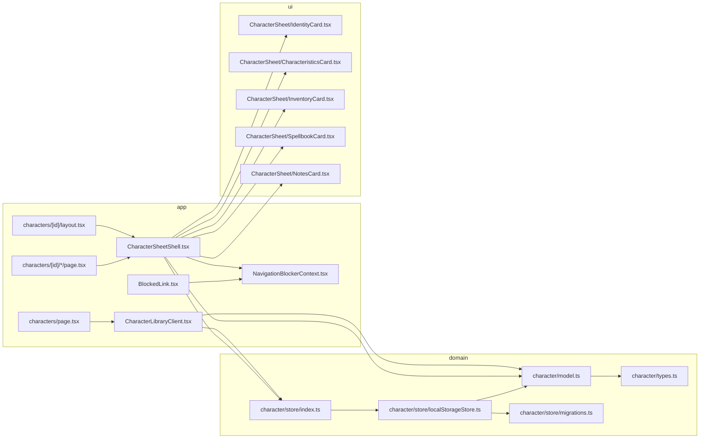

# Character manager

This document describes **what** the character manager implements (creation, saved sheets, constraints, import/export) and **how** it is wired in code (route flow, storage, normalization, navigation blocking). It is meant for maintainers and for AI assistants editing this repo.

Game: _Les Souvenirs du Protecteur_ (LSDP). UI strings live in `src/messages/fr.ts` (`copy.characters`).

Adaptive sheet night-mode preference is now global and documented in `docs/settings.md` (not stored per character).

---

## 1. Scope

| Area                | In scope                                                                                                     |
| ------------------- | ------------------------------------------------------------------------------------------------------------ |
| Character lifecycle | Create on `/characters/new` → persist → edit sheet on `/characters/[id]`                                     |
| Persistence         | Saved characters in **`localStorage`** (`lsdp:characters:v1`)                                                |
| Data model          | Typed `character` with archetype, stat pools, inventory, spellbook, journal entries, metadata timestamps     |
| Validation          | Domain validation before persistence (money >= 0, pool bounds, inventory/spellbook limits, non-empty labels) |
| Import/export       | JSON copy/export and file import with upsert/replace semantics in store                                      |
| Unsaved navigation  | Intercepts in-app links + back/forward + tab close when form is dirty                                        |
| UI split            | Library page (`/characters`) and detail sheet (`/characters/[id]`)                                           |

Out of scope (today): cloud sync, multi-device persistence, server-side storage, collaborative editing.

---

## 2. Conceptual model

### 2.1 Persistence tier

- **Saved characters**: canonical list persisted in `localStorage` under `lsdp:characters:v1`.
- Creation starts on `/characters/new` and only persists after explicit submit.

### 2.2 Character identity and timestamps

Each character has:

- stable `id` (`randomUUID` when available, fallback timestamp/random),
- `createdAt` and `updatedAt` ISO strings,
- lifecycle status `lifeStatus` (`alive` or `dead`),
- fixed `schemaVersion` (`CHARACTER_SCHEMA_VERSION = 1`).

`updatedAt` is refreshed on every save (`touchcharacter`) and is used for list ordering (latest first).

### 2.3 Archetype defaults

Archetype drives initial pool defaults:

- `warrior`: health 2, courage 4, stamina 3
- `pilgrim`: health 3, courage 2, stamina 4
- `bard`: health 4, courage 3, stamina 2

When the archetype field changes in the sheet UI, pools are reset to archetype defaults.

### 2.4 Capacity rules

- Inventory hard cap: **30**
- Inventory dynamic cap: **stamina.current \* 6**
- Effective inventory cap for validation: both constraints must pass.
- Spellbook cap: **6**
- For each pool (`health`, `courage`, `stamina`): `current <= max`
- `money >= 0`

The UI also mirrors caps (inventory add button disabled at current computed limit, spellbook add disabled at 6), but store validation is the authoritative guard.

### 2.5 Editing mode

`CharacterSheetShell` loads state in this order:

1. saved character by route id (`store.get`)
2. none (not found state)

### 2.6 Dead protector freeze

- Alive protectors can be marked as dead from the sheet.
- Once dead, the sheet becomes read-only and mutation actions are disabled.
- Store-level guard also blocks updates that try to mutate an already dead record.
- Dead protectors remain listed in the library with distinct styling.

---

## 3. Technical architecture

### 3.1 Module map

| Path                                              | Role                                                                          |
| ------------------------------------------------- | ----------------------------------------------------------------------------- |
| `src/lib/character/types.ts`                      | Core types (`character`, `StatPool`, `InventoryItem`, import result/mode)     |
| `src/lib/character/model.ts`                      | Defaults, normalization, id generation, validation, inventory cap computation |
| `src/lib/character/lifeStatus.ts`                 | Life status normalization and dead-freeze update rules                        |
| `src/lib/character/store/localStorageStore.ts`    | CRUD + import/export against `localStorage`                                   |
| `src/lib/character/store/migrations.ts`           | JSON parse/stringify envelope + merge strategy for imports                    |
| `src/lib/character/store/index.ts`                | In-memory singleton accessor `getCharacterStore()`                            |
| `src/app/characters/CharacterLibraryClient.tsx`   | Library list, create, delete, import, export, open sheet                      |
| `src/app/characters/[id]/CharacterSheetShell.tsx` | Sheet load/edit/save, draft handling, unsaved navigation guard                |
| `src/components/CharacterSheet/*.tsx`             | Form sub-sections: identity, characteristics, inventory, spellbook, journal   |
| `src/components/Navigation/BlockedLink.tsx`       | Link wrapper that consults navigation blocker handler                         |
| `src/app/contexts/NavigationBlockerContext.tsx`   | Shared blocker handler context                                                |

### 3.2 Creation and first edit flow

On `/characters`:

1. `handleCreate` navigates to `/characters/new`.

On `/characters/new` submit:

1. Resolve optional inheritance source (if selected).
2. Build character from minimal identity fields.
   - If inheritance is selected, copy full source `map` and `journalEntries`.
3. Persist with `store.save`.
4. Navigate to `/characters/<id>`.

### 3.3 Save flow

`handleFinish` in `CharacterSheetShell`:

1. Merge current form values into the loaded character object.
2. Call `store.save(payload)`.
3. Store normalizes + validates + touches timestamp.
4. Set local state and show success toast.

Validation errors are thrown as semicolon-separated messages and surfaced both in a toast and in an error alert block.

### 3.4 Import/export behavior

- **Export**: `store.exportAll()` returns a JSON string envelope:
  - `{ schemaVersion: 1, characters: [...] }`
  - copied to clipboard from the library page.
- **Import**: file text is parsed with `parsecharacters`.
  - accepts either raw arrays or envelope objects with `characters`.
  - invalid JSON or malformed entries collapse to an empty import set.
  - each imported character is validated for persistence; invalid records are discarded.
  - library currently imports in `upsert` mode from UI (`store.importAll(raw, 'upsert')`).

`upsert`: same id updates existing record, new id creates record.  
`replace`: supported by store API, but not currently exposed in library UI.

### 3.5 Normalization guarantees

Any boundary read/write normalizes data:

- storage reads (`parsecharacters`) normalize each record,
- saves normalize incoming payload,
- drafts normalize before save/load.

Normalization behavior includes:

- non-finite numerics coerced to integer fallbacks,
- `money` clamped to >= 0,
- pool values clamped to non-negative and `current <= max`,
- inventory/spellbook item ids auto-generated if missing,
- inventory and spellbook arrays truncated to 30/6,
- unsupported archetype/gender values replaced with defaults.

This makes persisted data robust against manual edits or old malformed payloads.

---

## 4. Unsaved navigation interception

The sheet blocks accidental navigation when form fields are dirty:

- **In-app links using `BlockedLink`**: `onNavigate` is prevented, then shared handler decides whether to continue.
- **Browser close/refresh**: `beforeunload` prompt when touched and interception is armed.
- **Back/forward (`popstate`)**: if user cancels leave, URL is restored to a stable snapshot.

Important details in `CharacterSheetShell`:

- Interception is delayed until after initial form settle (`setTimeout(..., 0)`) to avoid prompts during hydration/setup.
- `leaveConfirmingRef` prevents stacked modals.
- `setHandler` is registered/unregistered in `NavigationBlockerContext` so other pages remain unaffected.

---

## 5. UI composition

Saved mode sheet sections are grouped in cosmetic tabs over one shared form state:

- `Identity`: `IdentityCard`, `CharacteristicsCard`.
- `Map`: `ClockCard`, `MapCard`.
- `Inventory/Spellbook`: `InventoryCard`, `SpellbookCard`.
- `Journal`: `NotesCard`.
- `Tools`: `DiceRoll`, `CardDraw`.

Tab layout details and component boundaries are documented in `docs/character-tabs.md`.

Draft mode currently renders only `IdentityCard` plus cancel/save actions.

---

## 6. Storage formats

### 6.1 Library (`localStorage`)

- key: `lsdp:characters:v1`
- value: JSON string from `stringifycharacters`:
  - `schemaVersion: 1`
  - `characters: character[]`

## 7. Extension notes

1. **Adding fields to `character`**
   - update `types.ts`,
   - update defaults + normalization in `model.ts`,
   - update `SheetFormValues`, `toFormValues`, and save merge path in `CharacterSheetShell`,
   - update relevant section components and copy strings.
2. **Schema/version changes**
   - bump storage keys or add migration support in `migrations.ts`,
   - preserve backward decode when possible.
3. **Changing validation rules**
   - enforce in `validatecharacterForPersistence`,
   - reflect limits in UI components to avoid confusing save-time failures.
4. **Exposing replace import in UI**
   - library currently hardcodes `'upsert'`; add user choice before calling `store.importAll`.
5. **Tests**
   - existing scripts are `test` (Vitest), `test:coverage`, and `test:e2e` (Playwright).
   - prioritize:
     - normalization idempotence,
     - save validation errors,
     - import merge counts,
     - unsaved navigation guard behavior (unit/integration).

---

## 8. Quick reference

| Question                                       | Where to look                                      |
| ---------------------------------------------- | -------------------------------------------------- |
| How are default character values chosen?       | `createDefaultcharacterInput` in `model.ts`        |
| Why does archetype change reset pools?         | Archetype watcher effect in `CharacterSheetShell`  |
| Why can inventory save fail?                   | `validatecharacterForPersistence`                  |
| Where is local persistence implemented?        | `store/localStorageStore.ts`                       |
| What JSON shape does import/export use?        | `store/migrations.ts`                              |
| Why are unsaved-change prompts shown on links? | `BlockedLink` + `NavigationBlockerContext` + sheet |
| Where is character creation handled?           | `/characters/new` + `createFromIdentity`           |

---

_Last updated to match dedicated `/characters/new` creation, localStorage persistence, import/export JSON, and unsaved navigation interception in sheet editing._
