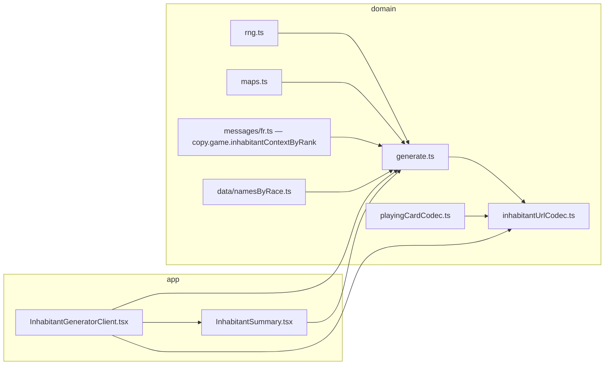

# Inhabitant builder (inhabitant generator)

This document describes **what** the inhabitant generator implements (table logic, book references) and **how** it is wired in code (state, URL, UI). It is meant for maintainers and for AI assistants editing this repo.

Game: _Les Souvenirs du Protecteur_ (LSDP). UI copy is primarily French (`src/messages/fr.ts`).

---

## 1. Scope

| Area               | In scope                                                                                                           |
| ------------------ | ------------------------------------------------------------------------------------------------------------------ |
| Type / people      | D6 → one of four races (`raceFromD6`)                                                                              |
| Name               | 2D6 → cell in a 6×6 grid per race (`namesByRace`, `lookupName`)                                                    |
| Age & personality  | One random playing card: **suit** → age band, **rank** → personality                                               |
| Context            | One random playing card: **rank only** → narrative hook (`contextByRank`); suit is irrelevant for rules            |
| Context follow-ups | Rank **7**: extra D6 (cartographer map type). Rank **10**: extra 2D6 → spoken name (same name table as inhabitant) |
| Gender             | Optional **table aid** (not core book): D6 → `Gender` (`genderFromD6`)                                             |

The app can **reroll** individual mechanical inputs while keeping the rest; derived fields (name string, context text, spoken name, etc.) stay consistent.

---

## 2. Conceptual model (what each input means)

### 2.1 Type (race) — one D6

`maps.raceFromD6`:

- 1–2 → `bruja`
- 3–4 → `cucurbitus`
- 5 → `kiore`
- 6 → `mousseron`

The stored die value is the **actual roll** (1–6), not an index. The label comes from `copy.races`.

### 2.2 Name — two D6 (“D66”)

Two independent D6, each 1–6. They index `namesByRace[race][die1 - 1][die2 - 1]` (see comment in `namesByRace.ts`: first die = row, second = column, matching the book’s “1D66” style table).

If the grid is ever mis-sized, `lookupName` falls back to `"—"`.

### 2.3 Age & personality — one playing card

- **Suit** → age band (`maps.ageBandFromSuit`): hearts → child, diamonds → teenager, clubs → adult, spades → elderly.
- **Rank** → personality (`maps.personalityFromRank`): fixed mapping from `A`, `2`–`10`, `J`, `Q`, `K` to the `Personality` union (see `maps.ts`).

Both suit and rank are rolled uniformly via `rng.randomCard`.

### 2.4 Context — one playing card (rank only)

`contextByRank[rank]` is rulebook-style text (stored in `messages/fr.ts` as `copy.game.inhabitantContextByRank`). It may include inline markup (`**bold**`, `*italic*`) rendered by `RichText` / `renderSimpleInlineMarkup`.

Special ranks (also reflected in UI):

- **7 — Cartographe**: after drawing this context, the book asks for **another D6** to choose _carte de localisation_ (1–3) vs _carte de biome_ (4–6). Implemented as `contextSevenDie` and `mapKindFromContextSevenDie` in `generate.ts`.
- **10 — Nom prononcé**: book points to the name table (p. 60). The app rolls **2D6** with the **current inhabitant race** and stores `contextSpokenNameDice` + `contextSpokenName` via `lookupName`.

### 2.5 Gender — one D6 (optional aid)

`types.Gender` and `maps.genderFromD6`:

- 1–2 → man
- 3–4 → woman
- 5 → non-binary
- 6 → indeterminate

Documented in code as optional; labels in `copy.genders`.

---

## 3. Technical architecture

### 3.1 Module map

| Path                                                                              | Role                                                                                                                                           |
| --------------------------------------------------------------------------------- | ---------------------------------------------------------------------------------------------------------------------------------------------- |
| `src/lib/inhabitant/generate.ts`                                              | `InhabitantRoll`, `generateInhabitant`, `rerollInhabitantPart`, context follow-ups, `getAgeBand` / `getPersonality`, `mapKindFromContextSevenDie` |
| `src/lib/inhabitant/maps.ts`                                                  | Deterministic mappings D6/card → race, gender, age band, personality                                                                           |
| `src/lib/inhabitant/genderSymbols.ts`                                         | `genderCompactSymbol` for one-line / owner summaries (matches `copy.genders` prefixes)                                                         |
| `src/messages/fr.ts` (`copy.game.inhabitantContextByRank`, export `contextByRank`) | Context paragraphs by rank                                                                                                                     |
| `src/lib/inhabitant/data/namesByRace.ts`                                      | `namesByRace` grids + `lookupName`                                                                                                             |
| `src/lib/inhabitant/inhabitantUrlCodec.ts`                                     | `encodeInhabitantRoll` / `decodeInhabitantRollParam` for query param `i`                                                                         |
| `src/lib/rng.ts`                                                             | `rollD6`, `roll2D6`, `randomCard`, `randomInt` — all generation goes through an injectable `rng: () => number` (default `Math.random`)         |
| `src/lib/playingCardCodec.ts`                                                | Shared 2-char card encoding (suit letter + rank code, `T` for ten)                                                                             |
| `src/lib/types.ts`                                                           | `Race`, `Suit`, `Rank`, `PlayingCard`, `Gender`, etc.                                                                                          |
| `src/app/generators/inhabitant/InhabitantGeneratorClient.tsx`                       | URL sync, roll-all, reroll callbacks, copy one-liner                                                                                           |
| `src/app/generators/inhabitant/page.tsx`                                           | Server wrapper + `Suspense` (required for `useSearchParams` on static routes)                                                                  |
| `src/components/InhabitantSummary/InhabitantSummary.tsx`                            | Descriptions + per-field reroll + context follow-up UI; footnote uses `copy.rulebook.inhabitantFootnote`                                               |
| `src/lib/rulebookPages.ts`                                                   | `RULEBOOK_PAGES` (inhabitant + village, incl. establishment detail pages) + `establishmentDetailRulebookPage`                                   |
| `src/messages/fr.ts` / `formatCopy.ts`                                            | `copy` + `formatInhabitantCopyOneLiner`                                                                                                         |

### 3.2 `InhabitantRoll` shape

Defined in `generate.ts`. Conceptually:

- **Stored random outcomes**: `raceDie`, `agePersonalityCard`, `contextCard`, `nameDice`, `genderDie`, and when applicable `contextSevenDie`, `contextSpokenNameDice`.
- **Derived / denormalized for convenience**: `race`, `name`, `contextText`, `gender`, `contextSpokenName` — always recomputed from the mechanical inputs when generating or decoding from URL so they stay aligned with data files.

`InhabitantRerollPart` enumerates which slice `rerollInhabitantPart` may replace. Rerolling `contextCard` clears follow-up fields then re-runs `rollContextFollowups` so rank 7/10 extras match the new card.

### 3.3 Generation order (`generateInhabitant`)

1. `raceDie` → `race`
2. `agePersonalityCard`
3. `contextCard` → `contextText`
4. `nameDice` → `name`
5. `genderDie` → `gender`
6. If `contextCard.rank === "7"`: roll `contextSevenDie`
7. If `contextCard.rank === "10"`: roll `contextSpokenNameDice` → `contextSpokenName`

So a full “roll all” includes automatic follow-up rolls when the context card is 7 or 10. The **UI** can still show a state where rank is 7 or 10 but follow-up dice are missing (e.g. old URL without tail — see §4); in that case `InhabitantSummary` offers buttons that call `rerollInhabitantPart('contextSevenDie')` or `('contextSpokenNameDice')` to fill them.

### 3.4 Playing card encoding (`playingCardCodec.ts`)

Cards are two symbols:

- Suit: `H` hearts, `D` diamonds, `C` clubs, `S` spades
- Rank: `2`–`9`, `T` (= ten), `J`, `Q`, `K`, `A`

Decoding is case-insensitive for those letters.

---

## 4. URL serialization (`?i=`)

**Query key:** `i` (see `INHABITANT_QUERY_KEY` in `InhabitantGeneratorClient.tsx`).

**Source of truth:** The client **derives** `roll` with `useMemo` from `decodeInhabitantRollParam(encoded)` — there is no separate React state for the roll. Updates go through `router.replace` with a new `i`.

**Invalid `i`:** If `encoded` is present but decode fails, an effect strips `i` from the URL (and the summary shows empty).

### 4.1 Payload layout

The codec builds a compact ASCII string (then often uppercased for parsing).

**Base (always):**

1. One char: race D6 `1`–`6`
2. Two chars: age/personality card (`encodePlayingCard`)
3. Two chars: context card
4. Two chars: name dice `1`–`6` each
5. One char: `genderDie` `1`–`6`

**Optional tail** (only when the corresponding follow-up exists in the roll):

- Context rank **7** and `contextSevenDie` set: **+1** char (D6). **Total length 9.**
- Context rank **10** and `contextSpokenNameDice` set: **+2** chars (two D6). **Total length 10.**

Valid lengths: **8, 9, 10**. Any other length → decode fails.

Tail interpretation (`decodeInhabitantRollParam`):

- After parsing the 8-char base, if `tail.length === 1`, context card must be rank 7 and tail is `contextSevenDie`.
- If `tail.length === 2`, context must be rank 10 and tail is the two name dice for the spoken name.

Encoding (`encodeInhabitantRoll`) appends the tail only when those follow-up fields are non-null and ranks match.

### 4.2 Bookmarks and data changes

URLs encode **dice and cards**, not free text. If you edit `contextByRank` or `namesByRace`, an old URL still produces the same mechanical result but **displayed** name/context/spoken name strings may change.

---

## 5. UI behavior

### 5.1 `InhabitantGeneratorClient`

- Wrapped in `<Suspense>` in `page.tsx` for Next.js prerender rules around `useSearchParams`.
- Uses `App.useApp()` from Ant Design for copy toasts.
- **Roll all:** `generateInhabitant()` → `encodeInhabitantRoll` → `router.replace`.
- **Reroll:** `rerollInhabitantPart(roll, part)` → same URL update.
- **Copy one-liner:** builds share URL with current `i`, formats line via `formatInhabitantCopyOneLiner(roll, shareUrl)` (includes gender symbol from `inhabitant/genderSymbols.genderCompactSymbol`, age, personality, optional map kind / spoken name, URL).

### 5.2 `InhabitantSummary`

Ant Design `Descriptions` with one section per concept. Each section can show a small reroll control when `onRerollPart` is provided.

Context rank **7** / **10**: if follow-up dice are missing, shows a button that triggers reroll for that part (first roll only). If present, shows result + reroll icon like other rows.

### 5.3 `RollActions`

Primary “generate all” plus optional copy-one-liner when a roll exists.

---

## 6. Internationalization

- **`copy`** holds all generator UI strings (`messages/fr.ts`).
- **`en`** exists as a stub for future use.
- Card **display** uses `PlayingCardLabel` (`copy.ranks` / `copy.suits`); aria text via `playingCardAriaLabel` in `messages/fr.ts` (« {rang} de {couleur} »).
- **`formatInhabitantCopyOneLiner`** lives in `messages/formatCopy.ts` but takes a `InhabitantRoll`; keep it in sync if you add fields to the summary line.

---

## 7. How to extend safely

1. **New race or D6 range change** — Update `raceFromD6`, `namesByRace`, and `copy.races`.
2. **New context rank** — Extend `contextByRank` (all `Rank` keys must exist) and, if the book adds extra rolls, extend `rollContextFollowups` + `InhabitantRoll` + codec + UI like rank 7/10.
3. **URL version bump** — Today there is no explicit version prefix; a future v2 format should either use a new query key or a prefixed scheme and keep `decodeInhabitantRollParam` accepting old values if you still need old links.
4. **Tests** — There is no test runner in `package.json` yet; if you add one, prioritize round-trip tests: `decode(encode(roll))` equals roll for representative cases (all context ranks, with/without tails).

---

## 8. Quick reference — file → responsibility

| Question                               | Where to look                                         |
| -------------------------------------- | ----------------------------------------------------- |
| How is a full inhabitant rolled?       | `generateInhabitant`                                   |
| What does one D6 mean for type/gender? | `maps.ts`                                             |
| What text appears for context rank X?  | `messages/fr.ts` → `copy.game.inhabitantContextByRank` |
| How are names chosen?                  | `data/namesByRace.ts` + `lookupName`                  |
| How do I bookmark/share?               | `?i=` + `inhabitantUrlCodec.ts`                        |
| How does reroll preserve consistency?  | `rerollInhabitantPart`                                 |
| Why Suspense on the page?              | Next.js + `useSearchParams` static prerender          |

---

_Last updated to match generator behavior as of the repo revision that includes gender, context follow-ups 7/10, per-part rerolls, and 8–10 char URL payloads._
