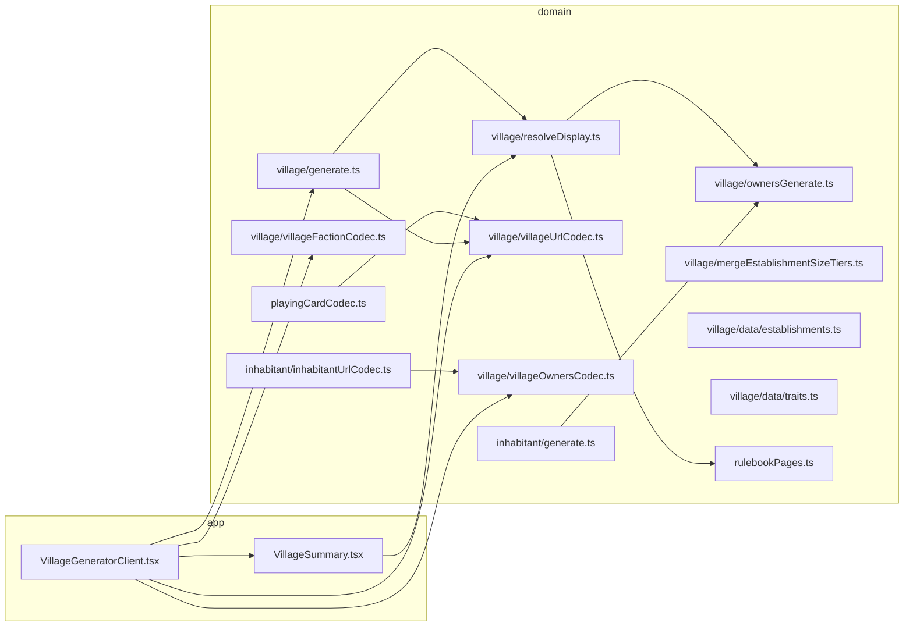

# Village builder (village generator)

This document describes **what** the village generator implements (rulebook-aligned draw logic, establishments, traits, owners) and **how** it is wired in code (resolution, URL, UI). It is meant for maintainers and for AI assistants editing this repo.

Game: _Les Souvenirs du Protecteur_ (LSDP). UI strings live in `src/messages/fr.ts` (`copy`). All **rulebook page** anchors (inhabitant + village chapters, establishment table, per-rank establishment detail) live in `src/lib/rulebookPages.ts` (`RULEBOOK_PAGES`, `establishmentDetailRulebookPage`). The village summary footnote uses `copy.rulebook.villageFootnote(RULEBOOK_PAGES.village.chapter, …)`.

---

## 1. Scope

| Area                 | In scope                                                                                                                                                                              |
| -------------------- | ------------------------------------------------------------------------------------------------------------------------------------------------------------------------------------- |
| Primary draw         | **5 playing cards** (`VillageRoll.primary`) — each card is either an **establishment** (ranks A–10) or a **village trait** (face card J, Q, K) per the book’s « Établissement » logic |
| Red Jack             | **Hearts or diamonds Jack** in the primary draw triggers **3 extra establishment cards** (`expansion`); black Jack is a trait only (no extra draws)                                   |
| Establishment labels | French lines from card rank + suit (petite/grande for some ranks, red/black variants for A, 9, etc.) — see `data/establishments.ts`                                                   |
| Trait text           | French rich-text paragraphs for each face rank + red/black — `data/traits.ts`                                                                                                         |
| Owners               | One **inhabitant** (`InhabitantRoll`) per **establishment row** after resolution (not per primary card slot). Co-owners when the UI **groups** duplicate establishment rows           |
| Village people       | A single **`Faction`** for the whole village (`f` query param). All owners are generated with `generateInhabitantWithFaction(faction, rng)`                                           |
| URL                  | Serializable village (`v`), owners (`o`), faction (`f`) for sharing and bookmarking                                                                                                   |
| Rerolls              | Reroll one **primary** slot (rebuilds expansion), reroll one **owner** only, optional **grouped** display (local state)                                                               |

Out of scope (today): persisting grouped view in the URL; generating owners for trait-only rows.

---

## 2. Conceptual model

### 2.1 `VillageRoll` — what is stored

- **`primary`**: exactly **5** `PlayingCard` values (fixed tuple type in `generate.ts`).
- **`expansion`**: **0 to 6** numbered cards (A–10 only, **no face ranks**). Length = **3 × (number of red Jacks in primary)**.

The URL codec concatenates **primary then expansion** as 2-symbol card codes (see §4). Decoding **rejects** invalid expansion length or any face card in the expansion segment.

### 2.2 Resolution order (`resolveVillageDisplay`)

`resolveDisplay.ts` is the **single source of truth** for:

1. **`traits`** — face cards in **primary**, in slot order, **merged by identical trait text** (so two red Queens share one paragraph in the UI but keep separate `primarySlot` values for reroll).
2. **`establishments`** — walk primary **left to right**:
   - **Numbered card (A–10)** → one establishment row (`establishmentLine`, reroll tied to that primary index).
   - **Red Jack** → **consume three** cards from `expansion` in order; each becomes an establishment row with **`rerollPrimarySlot: null`** (those cards are not individually rerollable via primary slots; rerolling the Jack replaces the whole expansion block).

After the loop, `expIdx` must equal `expansion.length` or the resolver throws (data invariant).

### 2.3 Establishment wording (`data/establishments.ts`)

- Ranks **2–8** use **petite / grande / immense** tiers. **Base** tier from suit: **red → grande (2)**, **black → petite (1)** (`suitIsRed`).
- Ranks **A, 9, 10** use `lineForRankOther` (red/black or fixed « Ruines » for 10).
- **`establishmentLine`** must not be called for J/Q/K (face cards).

### 2.4 Trait wording (`data/traits.ts`)

**`villageTraitText(card)`** returns markdown-style trait copy. **Red vs black** matters for J, Q, K. Red Jack includes the rule text about drawing three extra **numbered** establishments.

### 2.5 Duplicate establishments (book vs UI)

The **rulebook** allows interpreting duplicate establishment draws as two sites **or** one larger site. The app:

- **Default list**: one line per **resolved** establishment row (no merging).
- **Optional « Regrouper les doublons »** (checkbox in `VillageSummary`, **local React state only**): merges rows for display and adjusts labels (see §2.6).

The grey hint + checkbox stay **inside** the summary card; the **« Livre — Les villages… »** footnote is rendered **below** the card (`generator-rulebook-footnote` in `globals.css`).

### 2.6 Grouped display (`groupEstablishments` in `VillageSummary.tsx`)

Pure UI transform of `VillageEstablishmentRow[]`:

| Bucket key     | Grouping rule                                                     | Merged label                                                                                                  |
| -------------- | ----------------------------------------------------------------- | ------------------------------------------------------------------------------------------------------------- |
| `tier:<rank>`  | Same **rank** among ranks with three size tiers (2–8)             | Combine tiers with `mergeEstablishmentSizeTiers` → `establishmentLineFromSizeTier(rank, merged)`              |
| `plain:<text>` | Same **full establishment line string** (e.g. same A/red variant) | **2** copies → `Immense — <base>`; **3+** → `Immense (×n) — <base>` (`copy.village.mergedEstablishmentLabel`) |

**Owners:** `ownerIndices` lists global indices into `owners[]` (resolution order). Co-owners see **multiple** name lines under one establishment.

**Reroll primary card:** shown only when the group represents a **single** row with a non-null `rerollPrimarySlot` (cannot pick one slot ambiguously for merged multi-card groups).

### 2.7 `mergeEstablishmentSizeTiers` (`mergeEstablishmentSizeTiers.ts`)

Encodes the book’s duplicate-establishment sizing rule (smallest+smallest → middle, middle+middle → largest, mixed → middle), generalized to N draws by repeatedly merging the two smallest tiers. Tier **3** absorbs further merges.

### 2.8 Owners (`ownersGenerate.ts`)

- **`countVillageEstablishments(roll)`** = `resolveVillageDisplay(roll).establishments.length`.
- **`generateOwnersForVillage(roll, faction, rng)`** returns that many independent **`generateInhabitantWithFaction(faction)`** rolls.

Each owner’s **`InhabitantRoll.factionDie`** is set to the **canonical** D6 for the chosen faction (`canonicalFactionDie` in `inhabitant/maps.ts`) so `encodeInhabitantRoll` / `decodeInhabitantRollParam` round-trips consistently with a fixed village faction.

### 2.9 Village faction (`rafactionce` query param)

- **Allowed values:** `FACTIONS` in `types.ts` (`decodeVillageFactionParam`).
- **Precedence:** explicit `f` param → else, if all decoded owners share one faction, **infer** from `o` → else default **`bruja`** (`VillageGeneratorClient.tsx`).
- **Validation:** `ownersValid` requires every owner’s `f` to match `villageFaction`; otherwise the client **regenerates** owners for the current roll + faction.
- **Effects:** invalid `f` strings are stripped from the URL; missing `f` may be **hydrated** when `v` + `o` are valid so old links gain an explicit param.

---

## 3. Technical architecture

### 3.1 Module map

| Path                                                    | Role                                                                                                                                         |
| ------------------------------------------------------- | -------------------------------------------------------------------------------------------------------------------------------------------- |
| `src/lib/village/generate.ts`                           | `VillageRoll`, `generateVillageRoll`, `rerollVillagePrimarySlot`, `buildExpansionForPrimary`, `countRedJacksInPrimary`, expansion validation |
| `src/lib/village/resolveDisplay.ts`                     | `resolveVillageDisplay`, `VillageTraitRow`, `VillageEstablishmentRow`, `countVillageEstablishments`                                          |
| `src/lib/village/villageUrlCodec.ts`                    | `encodeVillageRoll` / `decodeVillageRollParam` for `v`                                                                                       |
| `src/lib/village/villageOwnersCodec.ts`                 | `encodeVillageOwners` / `decodeVillageOwnersParam` — `~`-joined `encodeInhabitantRoll` blobs                                                 |
| `src/lib/village/villageFactionCodec.ts`                | `decodeVillageFactionParam`                                                                                                                  |
| `src/lib/village/ownersGenerate.ts`                     | `generateOwnersForVillage`                                                                                                                   |
| `src/lib/village/mergeEstablishmentSizeTiers.ts`        | Tier merge for grouped same-rank establishments (ranks 2–8)                                                                                  |
| `src/lib/village/data/establishments.ts`                | `establishmentLine`, `establishmentLineFromSizeTier`, `rankUsesEstablishmentSizeTiers`                                                       |
| `src/lib/village/data/traits.ts`                        | `villageTraitText`                                                                                                                           |
| `src/lib/rulebookPages.ts`                              | `RULEBOOK_PAGES` (inhabitant + village, incl. per-rank establishment detail) + `establishmentDetailRulebookPage`                             |
| `src/app/generators/village/VillageGeneratorClient.tsx` | Toolbar, faction select, URL sync, roll / reroll owner / reroll slot / copy                                                                  |
| `src/components/VillageSummary/VillageSummary.tsx`      | Establishments + traits + owners + grouping + rulebook footnote fragment                                                                     |
| `src/messages/fr.ts` / `formatCopy.ts`                  | `copy`, `formatVillageCopyOneLiner`, `formatVillageRulebookPagesJoined`, village UI strings                                                  |

### 3.2 Reroll primary slot (`rerollVillagePrimarySlot`)

Replaces **one** card in `primary` at `slotIndex`, then **rebuilds the entire `expansion`** from scratch via `buildExpansionForPrimary` (new random numbered cards, correct length). Any previous expansion content is discarded. The client then **regenerates all owners** for the new roll (establishment count may change).

### 3.3 Reroll single owner

Replaces `owners[i]` with `generateInhabitantWithFaction(villageFaction)` and rewrites `o=` (and keeps `v`, `f`). Does not change the village cards.

---

## 4. URL serialization

**Route:** `/generators/village`.

| Query key | Meaning                                                                                                        |
| --------- | -------------------------------------------------------------------------------------------------------------- |
| `v`       | Village cards: `encodeVillageRoll` — 10 chars minimum (5 primary × 2), then 6 chars per red Jack (3 cards × 2) |
| `o`       | Owners: `~`-separated list of compact inhabitant payloads (same as inhabitant `i`)                             |
| `faction` | `bruja` \| `cucurbitus` \| `kiore` \| `mousseron`                                                              |

**Source of truth:** Like the inhabitant page, the client **derives** `roll` and owner list from the URL via `useMemo`; updates use `router.replace`.

### 4.1 Invalid `v`

If `v` is present but `decodeVillageRollParam` fails, an effect **strips** `v` and `o` from the query.

### 4.2 Owners out of sync

If `v` decodes but `o` is missing, wrong length, or any owner `faction !== villageFaction`, `ownersValid` is null and an effect **fills** `o` with `generateOwnersForVillage(roll, villageFaction)` and sets `v`/`f` as needed.

### 4.3 Copy one-liner

`formatVillageCopyOneLiner(roll, shareUrl, owners)` (`messages/fr.ts`): traits (bold stripped) and establishment lines joined, plus owner **names** if lengths match. The share URL should include `v`, `o`, and `f` (client builds this in `handleCopyOneLiner`).

---

## 5. UI behavior

### 5.1 `VillageGeneratorClient`

- Wrapped in `<Suspense>` in `page.tsx` (same `useSearchParams` constraint as the inhabitant page).
- **Toolbar:** `RollActions` on the left; **Peuple du village** `Select` on the right (`VillageGeneratorClient.css`, `margin-left: auto` on the faction block).
- **Roll all:** new `generateVillageRoll()` → push `v`, `o`, `f`.
- **Change faction:** updates `f`; if a village exists, **regenerates all owners** for the new faction.
- **Reroll establishment card:** `rerollVillagePrimarySlot` → new `v` + full owner regen.

### 5.2 `VillageSummary`

- **Establishments:** numbered list with optional per-line page citation (`formatVillageRulebookPagesJoined`).
- **Traits:** list with `RichText`; merged duplicate trait **text** shows **one** paragraph, **multiple** card labels and **multiple** reroll buttons (one per `primarySlot`).
- **Owners:** name links to `/generators/inhabitant?i=…` (`encodeInhabitantRoll`), age + personality, per-owner reroll when callback provided.
- **Grouped mode:** local `useState` only; does not affect URL or owner count.

### 5.3 Rulebook footnote

Rendered **outside** the Ant Design `Card` as a sibling in a fragment, with class **`generator-rulebook-footnote`** (see `globals.css`). Same pattern as `InhabitantSummary` for inhabitants.

---

## 6. Copy layout

- Establishment and trait **game text** lives under `village/data/`, not in `messages/fr.ts`.
- `copy.village.*` holds UI chrome (section titles, duplicate hint, grouping toggle, reroll labels, copy strings).
- `copy.rulebook.villageFootnote` takes page numbers from `RULEBOOK_PAGES.village` so you can retune `rulebookPages.ts` for the whole app.

---

## 7. How to extend safely

1. **New establishment rank or red/black variant** — Update `establishments.ts` and, if the book adds a detail page, `rulebookPages.ts` (`RULEBOOK_PAGES.village.establishmentDetailByRank` / `establishmentTable`).
2. **New trait (face rank)** — Extend `traits.ts` and ensure `isFaceRank` in `types.ts` still classifies it; resolver picks it up automatically.
3. **URL length change** — `decodeVillageRollParam` assumes 2 chars per card and derives expansion count from red Jacks; keep `encode`/`decode` symmetric.
4. **Owner payload change** — Any change to `InhabitantRoll` / `encodeInhabitantRoll` affects **`o=`**; old village links may fail decode until regenerated; consider backward compatibility in `inhabitantUrlCodec` before breaking blobs.
5. **Tests** — existing scripts are `test` (Vitest), `test:coverage`, and `test:e2e` (Playwright). Prioritize: `decodeVillageRollParam(encodeVillageRoll(roll))` for 0–2 red Jacks; `resolveVillageDisplay` row counts; `countVillageEstablishments` === `o` split count after `generateOwnersForVillage`.

---

## 8. Quick reference — file → responsibility

| Question                                   | Where to look                                                             |
| ------------------------------------------ | ------------------------------------------------------------------------- |
| How many cards in the village URL?         | `villageUrlCodec.ts` — 5 primary + 3× red jacks                           |
| What is an establishment line for card X?  | `establishmentLine` / `establishmentLineFromSizeTier`                     |
| Why are two traits merged into one line?   | `resolveVillageDisplay` groups by `villageTraitText` string               |
| How are duplicate shops grouped in the UI? | `groupEstablishments` + `mergeEstablishmentSizeTiers`                     |
| How many owners should exist?              | `countVillageEstablishments`                                              |
| How is village faction enforced?           | `VillageGeneratorClient` + `generateInhabitantWithFaction`                |
| Where are book page numbers?               | `rulebookPages.ts` — `RULEBOOK_PAGES` + `establishmentDetailRulebookPage` |

---

_Last updated to match the village generator as of the revision that includes `v`/`o`/`f` URLs, merged trait rows, grouped establishment view, per-owner reroll, and footnotes below summary cards._
